# 人工智能（ArtificialIntelligence）
> 本文主要以PyTorch为主

## 资源链接
- [Pytorch官网](https://pytorch.org/)
- [Anaconda下载地址](https://www.anaconda.com/)
- [油管教程 - 土堆 33集](https://www.youtube.com/watch?v=QJgjcnuQqNI&list=PLgAyVnrNJ96CqYdjZ8v9YjQvCBcK5PZ-V)
- [油管教程 - 莫烦 35集](https://www.youtube.com/watch?v=lAaCeiqE6CE&list=PLXO45tsB95cJxT0mL0P3-G0rBcLSvVkKH)

## 环境安装
*Anaconda* [下载地址](https://www.anaconda.com/download)

创建环境命令
```
conda create -n pytorch310 python=3.10
```
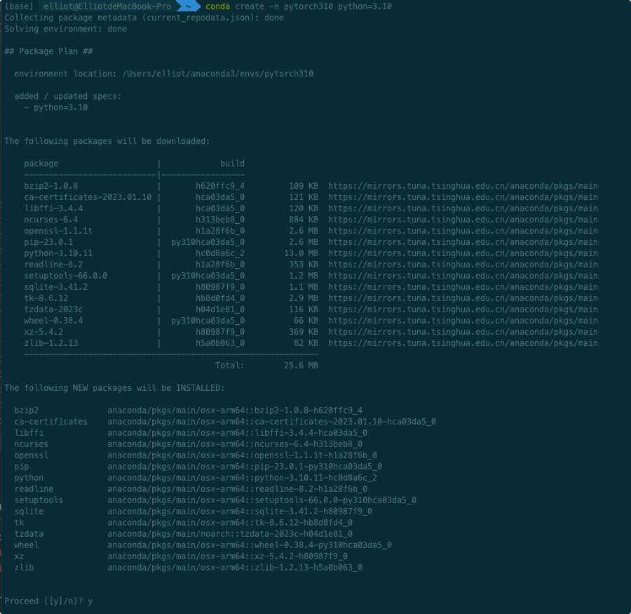
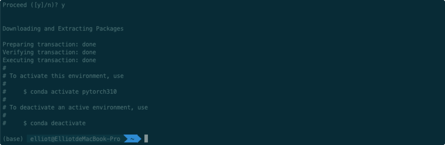
激活环境命令
```
conda activate pytorch310
```
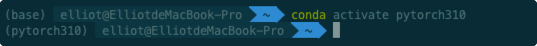
去激活环境命令
```
conda deactivate
```

> 报错处理：
  - 1.移除代理 
    ```
    conda config --remove-key proxy
    ```

  - 2.使用镜像 
    ```
    conda config --set remote_read_timeout_secs 600 conda config --add channels https://mirrors.tuna.tsinghua.edu.cn/anaconda/pkgs/free/
    conda config --add channels https://mirrors.tuna.tsinghua.edu.cn/anaconda/pkgs/main/
    conda config --add channels https://mirrors.tuna.tsinghua.edu.cn/anaconda/cloud/pytorch/
    ```
  
  - 3.临时禁用代理 
    ```
    conda config --set proxy_servers.http ""
    conda config --set proxy_servers.https ""
    ```
---
*Pytorch安装* [官网地址](https://pytorch.org/)


选择对应的版本，复制命令即可

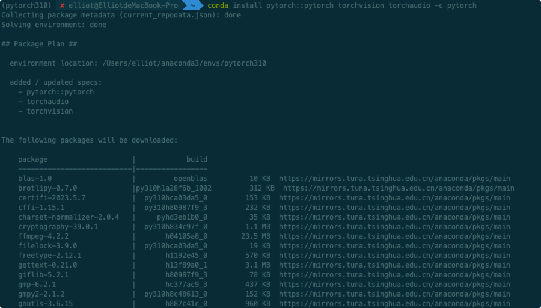
省略其余安装包

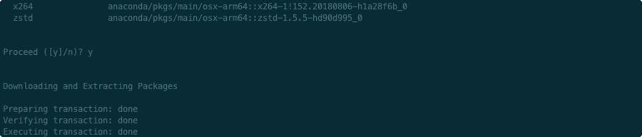
安装完成

---
验证是否安装成功 

pip
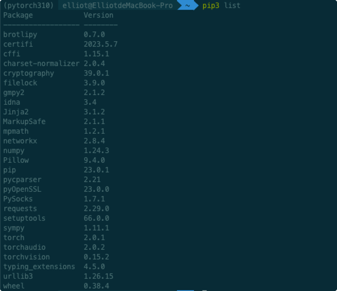

命令行导入测试，无报错则安装成功
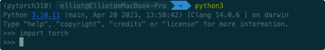

## 编辑器安装
*Pycharm* [下载地址](https://www.jetbrains.com/pycharm/download/#section=windows)

*Jupiter* 安装及使用

> python < 3.10 以下可使用 conda install nb_conda

python >= 3.10 可使用 conda install -c conda-forge nb_conda_kernels

开启Jupyter NoteBook命令：jupyter notebook


## 激励函数 (Activation)
激励函数根据不同情况需要有不同选择
- 卷积神经网络：ReLU
- 循环神经网络：Relu Or Tanh

在AnaConda中使用matplotlib
```
conda install matplotlib
```
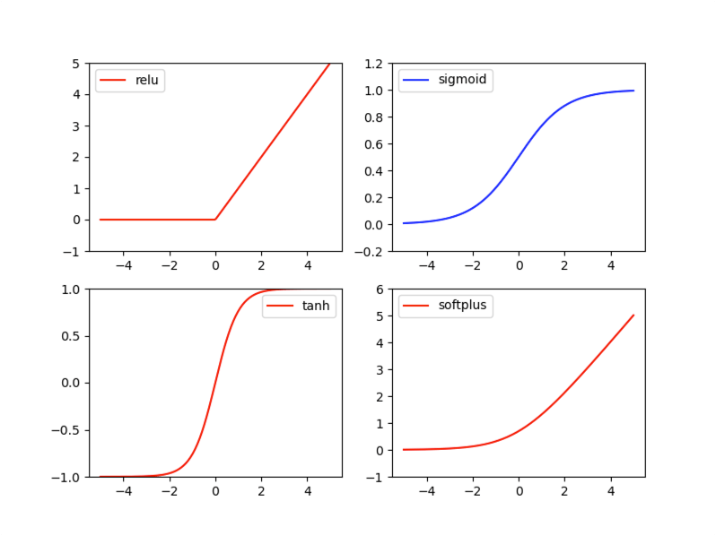
```python
# 激励函数
import torch
import torch.nn.functional as F
from torch.autograd import Variable
import matplotlib.pyplot as plt

# fake data
# x data (tensor), shape=(100,1)
x = torch.linspace(-5, 5, 200)
x = Variable(x)
x_np = x.data.numpy()

y_relu = F.relu(x).data.numpy()
y_sigmoid = F.sigmoid(x).data.numpy()
y_tanh = F.tanh(x). data.numpy()
y_softplus = F.softplus(x).data.numpy()


plt.figure(1, figsize=(8, 6) )
plt.subplot(221)
plt.plot(x_np, y_relu, c='red', label='relu')
plt.ylim((-1, 5))
plt.legend(loc='best')

plt.subplot(222)
plt.plot(x_np, y_sigmoid, c='blue', label='sigmoid')
plt.ylim((-0.2, 1.2))
plt.legend(loc='best')


plt.subplot(223)
plt.plot(x_np, y_tanh, c='red', label='tanh')
plt.ylim((-1, 1))
plt.legend(loc='best')

plt.subplot(224)
plt.plot(x_np, y_softplus, c='red', label='softplus')
plt.ylim((-1, 6))
plt.legend(loc='best')

plt.show()
```

## 回归 Regression
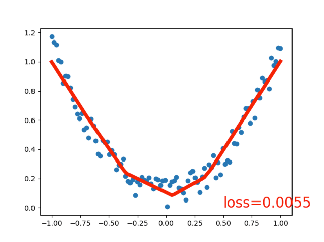
``` python
# 回归 Regression 

import torch
import torch.nn.functional as F
from torch.autograd import Variable
import matplotlib.pyplot as plt

x = torch.unsqueeze(torch.linspace(-1, 1, 100), dim=1)
y = x.pow(2) + 0.2 * torch.rand(x.size())

x, y = Variable(x), Variable(y)


# 打印
# plt.scatter(x.data.numpy(), y.data.numpy())
# plt.show()

class Net(torch.nn.Module):
    def __init__(self, n_feature, n_hidden, n_output):
        super(Net, self).__init__()
        self.hidden = torch.nn.Linear(n_feature, n_hidden)
        self.predict = torch.nn.Linear(n_hidden, n_output)

    def forward(self, x):
        x = F.relu(self.hidden(x))
        x = self.predict(x)
        return x


net = Net(1, 10, 1)
print(net)

plt.ion()
plt.show()

optimizer = torch.optim.SGD(net.parameters(), lr=0.5)
loss_func = torch.nn.MSELoss()

for t in range(100):
    prediction = net(x)

    loss = loss_func(prediction, y)

    optimizer.zero_grad()
    loss.backward()
    optimizer.step()
    if t % 5 == 0:
        plt.cla()
        plt.scatter(x.data.numpy(), y.data.numpy())
        plt.plot(x.data.numpy(), prediction.data.numpy(), 'r-', lw=5)
        plt.text(0.5, 0, 'loss=%.4f' % loss.data.item(), fontdict={'size': 20, 'color': 'red'})
        plt.pause(0.1)


plt.ioff()
plt.show()

```

## 分类 Classification
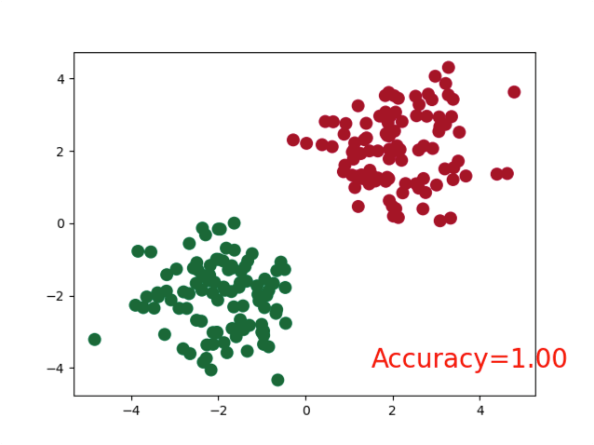
```
# 分类 Classification
import torch
import torch.nn.functional as F
from torch.autograd import Variable
import matplotlib.pyplot as plt

# 不同的代码
n_data = torch.ones(100, 2)
x0 = torch.normal(2 * n_data, 1)  # class0 x data (tensor), shape=(100, 2)
y0 = torch.zeros(100)  # class0 y data (tensor), shape=(100, 2)
x1 = torch.normal(-2 * n_data, 1)  # class1 x data (tensor), shape=(100, 2)
y1 = torch.ones(100)  # class2 y data (tensor), shape=(100, 2)
x = torch.cat((x0, x1), 0).type(torch.FloatTensor)  # FloatTensor = 32-bit floating
y = torch.cat((y0, y1), ).type(torch.LongTensor)  # LongTensor = 64-bit integer

x, y = Variable(x), Variable(y)

plt.scatter(x.data.numpy()[:, 0], x.data.numpy()[:, 1], c=y.data.numpy(), s=100, lw=0, cmap='RdYlGn')
plt.show()


# 打印
# plt.scatter(x.data.numpy(), y.data.numpy())
# plt.show()

class Net(torch.nn.Module):
    def __init__(self, n_feature, n_hidden, n_output):
        super(Net, self).__init__()
        self.hidden = torch.nn.Linear(n_feature, n_hidden)
        self.predict = torch.nn.Linear(n_hidden, n_output)

    def forward(self, x):
        x = F.relu(self.hidden(x))
        x = self.predict(x)
        return x


net = Net(2, 10, 2)
print(net)

plt.ion()
plt.show()

optimizer = torch.optim.SGD(net.parameters(), lr=0.02)
loss_func = torch.nn.CrossEntropyLoss()

for t in range(100):
    out = net(x)
    loss = loss_func(out, y)

    optimizer.zero_grad()
    loss.backward()
    optimizer.step()

    if t % 2 == 0:
        # plot and show learning process
        plt.cla()
        prediction = torch.max(F.softmax(out, dim=1), 1)[1]  # 预测分类结果
        pred_y = prediction.data.numpy()
        target_y = y.data.numpy()
        plt.scatter(x.data.numpy()[:, 0], x.data.numpy()[:, 1], c=pred_y, s=100, lw=0, cmap='RdYlGn')
        accuracy = float((pred_y == target_y).astype(int).sum()) / float(target_y.size)
        plt.text(1.5, -4, 'Accuracy=%.2f' % accuracy, fontdict={'size': 20, 'color': 'red'})
        plt.pause(0.1)

plt.ioff()
plt.show()

```

## 快速搭建神经网络
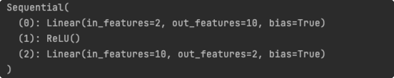
```
net2 = torch.nn.Sequential(
    torch.nn.Linear(2,10),
    torch.nn.ReLU(),
    torch.nn.Linear(10,2),
)
print(net2)
```

