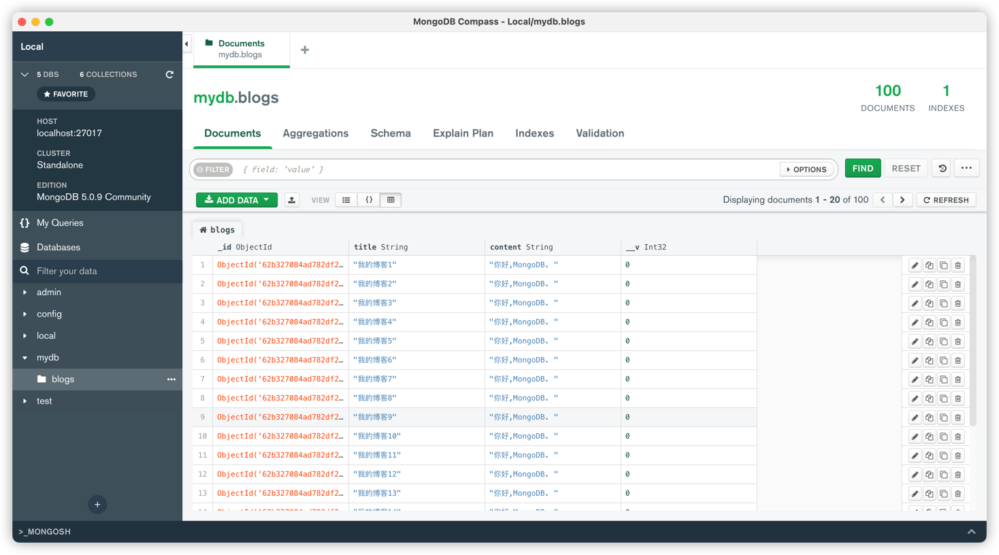

# MongoDB
> [视频地址](https://www.bilibili.com/video/BV1vL4y1J7i3?p=11&vd_source=5d78fd36d57a6318eced8020d4c4c6f9)

## 1.NoSQL 简介
> [菜鸟教程](https://www.runoob.com/mongodb/nosql.html)

## 2.MongoDB 概念解析

|   SQL术语/概念    | MongoDB术语/概念 | 解释/说明 |
|:-----------:|:-----------:|:------------|
|database |	database | 	数据库|
|table |	collection | 	数据库表/集合|
|row |	document | 	数据记录行/文档|
|column | field | 数据字段/域 |
|index |	index | 	索引|
|table | joins | 	 	表连接,MongoDB不支持|
|primary | key | 	primary key	主键,MongoDB自动将_id字段设置为主键|

[//]: # (## NodeJS Mongoose)

[//]: # (> 基于开发 ExpressAPI 项目获知)

[//]: # ()
[//]: # ([mongoose]&#40;https://mongoosejs.com/&#41;)

[//]: # ()
[//]: # (## 可用链接)

[//]: # (> 基于开发 ExpressAPI 项目获知)

[//]: # ([【图文教程】新手友好的MongoDB云数据库Atlas使用]&#40;https://zhuanlan.zhihu.com/p/98916948&#41;)

## 3.MongoDB安装
> 强烈推荐使用Docker安装！以下为 docker-compose 示例

### 数据存放目录
```bash
# 建立本地 mongo 目录
mkdir mongo & mkdir mongo/initdb
# 初始化脚本js等
mkdir mongo/initdb
# 数据库保存文件夹
mkdir mongo/datadir
# 数据库服务设置
mkdir mongo/configdb
```

### docker-compose.yml
```ymL
version: '3'
services:
    mongo:
        image: mongo:4.2
        container_name: mongo
        ports: 
            - '27017:27017'
        command: --auth
        volumes:
            - /Users/elliot/database/mongo/initdb:/docker-entrypoint-initdb.d
            - /Users/elliot/database/mongo/datadir:/data/db
            - /Users/elliot/database/mongo/configdb:/data/configdb
        environment:
            MONGO_INITDB_ROOT_USERNAME: MongoDBAdmin
            MONGO_INITDB_ROOT_PASSWORD: TxServerMongo
            MONGO_INITDB DATABASE: mydb
            TZ: Asia/Shanghai
```

### docker-compose 服务的启动及停止
> PS：要进入对应目录(/Users/elliot/database/mongo)执行命令，否则会报错
```bash
# 编译服务
docker-compose build
# 容器启动（精灵线程）
docker-compose up -d
# 查询容器状态
docker-compose ps

# 容器停止
docker-compose stop
# 容器停止+消除(容器+网络）
docker-compose down
# 容器停止+消除(容器+网络+镜像）
docker-compose down --rmi all

```

## 4.MongoDB连接
> 推荐官方出品的免费软件 MongoDB Compass，
```bash
mongodb://用户名:密码@localhost:27017/?authMechanism=DEFAULT
```

MongoDB Compass:


## 5.数据库相关操作
| 命令                | 解释        | 说明           |
|:------------------|:----------|:-------------|
| show dbs          | 查看所有数据库   | 空数据库不会展示     |
| use 库命            | 使用(创建)数据库 | 存在则切换，不存在则创建 |
| db                | 显示当前数据库   | -            |
| db.dropDatabase() | 删除数据库     | 删除数据库        |

> 默认库说明：
> 
> admin: 是"root"数据库，如果将一个用户添加到这个数据库中，这个用户自动继承数据库的权限，一些特定的服务器命令也只能从这个数据库运行(如：列出所有数据库或关闭服务器)
> 
> local: 这个库永远不会被复制，可用来存储咸鱼本地单台服务器的任意集合
> 
> config: 当MongoDB用于分片设置时，config数据库在内部使用，用于保存分片的相关信息

## 6.集合相关操作
| 命令                                     | 解释        | 说明                 |
|:---------------------------------------|:----------|:-------------------|
| show collections/tables                | 查看所有集合    | -                  |
| db.createCollection('集合名称',[options]) | 创建集合      | 向不存在的集合插入数据会自动创建集合 |
| db.集合名称.drop()                         | 删除集合      | -                  |

> createCollection说明：
> 
> capped(布尔值)：如果为true，则创建固定集合(指有固定大小的集合，当打到最大值时，会覆盖最早的文档，**当值为true时，必须指定size参数**)
> 
> size(数值)：为固定集合指定的一个最大值(字节数)，**如 capped为true，也需要指定该字段**
> 
> max(数值)：指固定集合中包含文档的最大数量

## 7.文档相关操作

- 插入文档
  - 单条
    - ```
      db.集合名称.insert({name: 'Elliot',age: 32})
      ```
  - 多条
    - ```
        db.集合名称.insertMany(
            [<document 1>],[<document 2>],
            {
                writeConcern: 1, // 写入策略，默认1，要求确认写操作，0则不要求，
                ordered: true, // 指定是否按顺序写入，默认true，按顺序写入
            }
        )
      
       // insert 也可以添加多条
        db.集合名称.insert(
            [<document 1>],[<document 2>],
            {
                writeConcern: 1, // 写入策略，默认1，要求确认写操作，0则不要求，
                ordered: true, // 指定是否按顺序写入，默认true，按顺序写入
            }
        )
      ```
  - 脚本
    - ```
        for (let i=0;i<100;i++) {
            db.user.insert({"_id":1,"name":"Elliot" + 1,"age": 32})
        }
      ```
- 查询
  - ```
    db.集合名称.find();
    ```
- 删除
  - ```
    db.集合名词.remove(
      <query>,
      {
        justOne: <boolean>,
        writeConcern: <document>,
      }
    )
    ```
- 更新
  - ```
    db.集合名称.update(
        <query>, // update的查询条件，类似于sql update 查询neiwhere后的部分
        <update>, // update对象和一些更新的操作符等，也可以理解为sql upate查询内set后的部分
        {
            upsert: <boolean>, // 可选，默认false，如果不存在update，是否插入objNew，true：插入，false：不插入
            multi: <boolean>, // 可选，默认false，只更新找到的第一条记录，如果这个参数为true，则会把按照条件查出来的多条记录全部更新
            writeConcern: <document>, // 可选，抛出异常的级别
        }
    )
    ```
  - > db.集合名称.update({"name":"Elliot"},{$set:{"name":"Elliot"}})，如果不加$set,会将原始数据全部删除后再添加
